# Studium przypadku
Szymon Pasternak, 148146

14.06.2024

## Wstęp

Praca dotyczy analizy zbioru danych oddanych rzutów w koszykarskiej lidze NBA. Głównym celem jest utworzenie klasyfikatora będącego w stanie przewidzieć efekt akcji rzutowej opisanej przez atrybuty warunkowe takie jak na przykład odległość od kosza czy czas posiadania piłki przed rzutem.

## Opis zbioru danych

Wybrany zbiór danych to to [nba-shot-logs](https://www.kaggle.com/datasets/dansbecker/nba-shot-logs). Zawiera on dane o rzutach oddanych w meczach koszykarskiej ligi NBA. Oryginalne dane posiadają 21 atrybutów oraz prawie 130 tysięcy przypadków. Atrybuty dostępne w zbiorze to:
- `GAME_ID` - id meczu, w którym odbył się rzut,
- `MATCHUP` - opis kiedy i jakie drużyny grały ze sobą mecz,
- `LOCATION` - lokalizacja meczu, w którym doszło do opisanego rzutu. Wartość `A` oznacza mecz na wyjeździe, a wartość `H` w domu,
- `W` - wygrana (`W`) lub przegrana (`L`) zepsołu, którego zawodnik oddał rzut,
- `FINAL_MARGIN` - ostateczna różnica punktów pomiędzy drużynami w meczu,
- `SHOT_NUMBER` - numer rzutu, którym był ten oddany przez gracza, np pierwszy rzut, drugi, itd.
- `PERIOD` - numer kwarty, w której rzut został oddany,
- `GAME_CLOCK` - czas ubiegły od rozpoczęcia kwarty podczas oddawania rzuty w formacie `mm:ss`,
- `SHOT_CLOCK` - liczba sekund jaka minęła już w akcji,
- `DRIBBLES` - liczba kozłów wykonanych przez zawodnika przed oddaniem rzutu,
- `TOUCH_TIME` - czas posiadania piłki zawodnika przed oddaniem rzutu,
- `SHOT_DIST` - dystans od kosza mierzony w stopach,
- `PTS_TYPE` - typ rzutu, posiada wartość `2` lub `3`,
- `SHOT_RESULT` - rezultat rzutu, `made` jeśli trafiony, `missed` jeśli nietrafiony,
- `CLOSEST_DEFENDER` - nawisko i imię najbliższego obrońcy,
- `CLOSEST_DEFENDER_PLAYER_ID` - id najbliższego obrońcy,
- `CLOSE_DEF_DIST` - dystans do najbliższeo obrońcy mierzony w stopach,
- `FGM` - wartość `0` lub `1` oznaczająca nietrafienie lub trafienie rzutu,
- `PTS` - liczba zdobytych punktów,
- `player_name` - imię i nazwisko zawodnika oddającego rzut,
- `player_id` - id zawodnika oddającego rzut,

### Dostosowanie zbioru danych
Zbiór danych zawiera sporo błędów, dlatego trzeba go poprawić. Prace związane ze wstępnym przetworzeniem danych zawierały:
- usunięcie wierszy, w których któraś z wartości jest pusta,
- usunięcie kolumny `MATCHUP` - jest ona zapisana w różny sposób i nie wnosi wiele informacji przydatnych do zadania,
- zamieniene formatu `mm:ss` z atrybutu `GAME_CLOCK` na czas w sekundach oraz usunięcie wartości mniejszych od 0 i większych od 12:00,
- usunięcie wartości `SHOT_CLOCK` mniejszych od 0 oraz większych od 24,
- usunięcie wartośći `TOUCH_TIME` mniejszych od 0 oraz większych od 24,
- usunięcie wartośći mniejszych od 0 w `SHOT_DIST` oraz wszystkich wierszy, gdzie dystans jest mniejszy niż 22 stopy i jest oznaczony w `PTS_TYPE` jako rzut za 3 punkty oraz rzutów dalszych niż 23.75 m oznaczonych jako rzuty za 2 punkty,
- usunięcie kolumny `CLOSEST_DEFENDER`, ponieważ wystarczy id obrońcy,
- usunięcie wartości `CLOSE_DEF_DIST` mniejszych od 0,
- usunięcie kolumny `FGM`, ponieważ jest ona innym zapisem atrybutu `SHOT_RESULT`,
- usunięcie kolumny `PTS`, ponieważ przekazuje informację o trafieniu lub nietrafieniu rzutu,
- usunięcie kolumny `player_name`, ponieważ wystarczy id zawodnika,
- wykonanie kodowania one-hot dla danych kategorycznych w celu umożliwienia działania na przykład klasyfikatorów drzew decyzyjnych.

### Korelacje w zbiorze danych
Poniższy obrazek przedstawia macierz korelacji atrybutów w zbiorze. Pominięte zostały atrybuty będące identyfikatorami zawodników lub meczów, z uwagi na ich dużą liczbę. Na wykresie można zauważyć, że najsilniej skorelowane są następujące atrybuty:
- `PERIOD` z `SHOT_NUMBER`, czyli numer kwarty z numerem rzutu - korelacja oznacza, że im wyższy numer kwarty w której oddawany był rzut, tym był to zazwyczaj wyższy numer rzutu oddanego przez danego zawodnika,
- `TOUCH_TIME` z `DRIBBLES`, czyli czas posiadania piłki oraz liczba kozłów - korelacja ta jest dodatnia, czyli im dłuższy czas prz piłce, tym więcej kozłów,
- `SHOT_DIST` z `CLOSE_DEF_DIST`, czyli odległość zawodnika od kosza w momencie oddawania rzutu oraz odległość najbliższego obrońcy do zawodnika - tutaj również korelacja jest dodatnia, co oznacza, że wraz ze zwiększeniem odległości od kosza, zwiększała się również odległość od najbliższego obrońcy. Działa to również w drugą stronę, czyli że wraz ze zbliżeniem się do kosza robi się "ciaśniej". Podobną korelację można zauważyć pomiędzy `PTS_TYPE` a `CLOSE_DEF_DIST`,
- Ciekawą korelacją, chociaż już mniejszymi (o wpsółczynnikach korelacji o wartości bezwzględnej około 0.2) jest to, że `LOCATION` jest skrelowane z `FINAL_MARGIN`, czyli drużyny wygrywały większą różnicą punktów (lub przegrywały mniejszą) na meczach domowych, a na wyjeździe było odwrotnie,
- Kolejnymi równie ciekawymi korelacjami są te pomiędzy `TOUCH_TIME` (oraz razem z nim `DRIBBLES`) a `SHOT_DIST` oraz `TOUCH_TIME` (i `DRIBBLES`) a `CLOSE_DEF_DIST`. Wynika z nich, że im dłużej zawodnik miał piłkę, tym częściej jego akcja kończyła się rzutem z bliższej odległości. Wraz ze wzrostem posiadania piłki przez zawodnika zmniejszała się również jego odległość do obrońcy, co jest powiązane z korelacją pomiędzy `SHOT_DIST` a `CLOSE_DEF_DIST`.

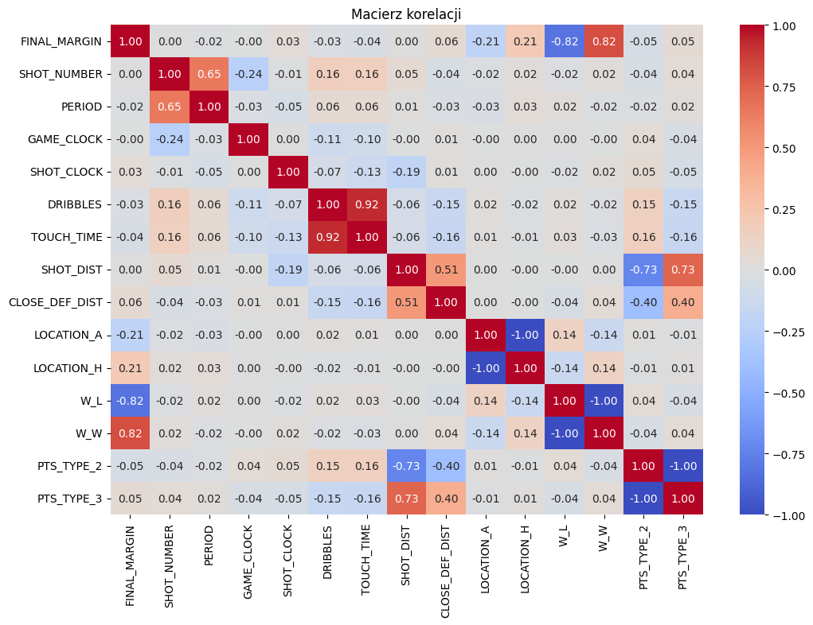

W analizie pominięte zostały oczywiste korelacje takie jak odległość od kosza `SHOT_DIST` i typ rzutu `PTS_TYPE`, ostateczna różnica punktowa `FINAL_MARGIN` i informacja o wygranej `W` oraz korelacje wynikające z zastosowanie kodowania one-hot dla atrybutów kategorycznych takich jak `W`, `LOCATION` czy `PTS_TYPE`.

### Atrybut decyzyjny
#### SHOT_RESULT
Atrybut `SHOT_RESULT` odpowiada za rezultat rzutu. Posiada wartość `made` jeśli rzut został trafiony, a `missed` jeśli nie został trafiony.

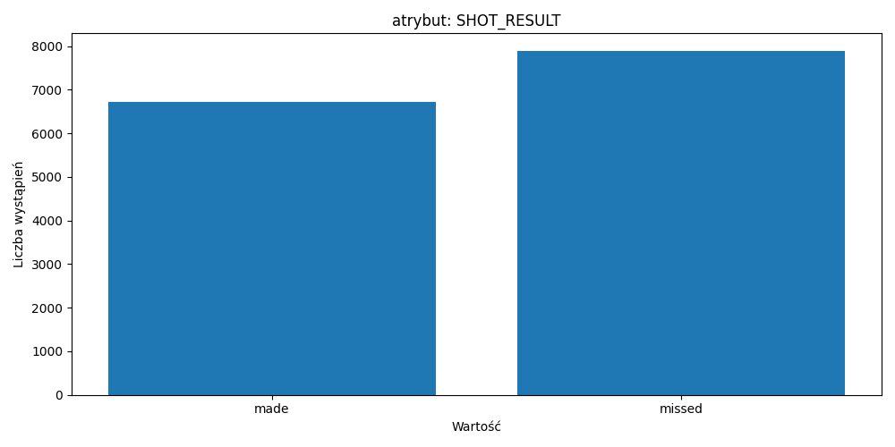

Na wykresie można zaobserwować, że liczba przykładów w każdej z klas jest bliska połowie wszystkich przykładów w zbiorze - dane są zbalansowane.

### Atrybuty warunkowe

#### GAME_ID
Atrybut `GAME_ID` jest identyfikatorem meczu, w którym został oddany rzut. Każy mecz pojawia się średnio 64 razy w zbiorze danych, co oznacza, że dla jednego meczu są średnio 64 zarejestrowane akcje rzutowe.

#### LOCATION
Atrybut `LOCATION` odpowiada za lokalizacje meczu, w którym doszło do opisanego rzutu. Wartość `A` oznacza mecz na wyjeździa, a `H` w domu.

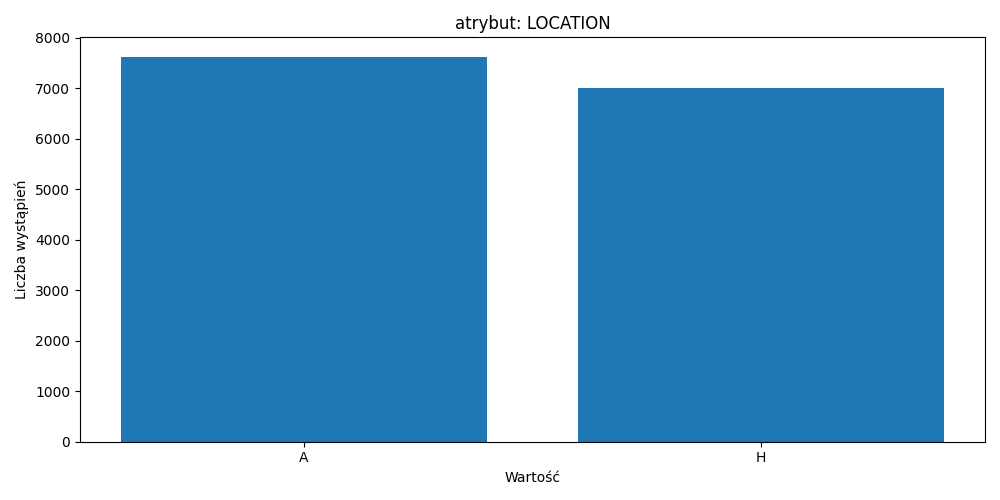

Atrybut rozłożony jest pomiędzy dwie możliwe wartości po równo. W zestawie danych znajduje się podobna liczba rzutów oddanych w grach na wyjeździe i w domu.

#### W
Atrybut `W` odpowiada za oznaczenie wygranej lub przegranej drużyny zawodnika oddającego rzut w akcji. Wartość `W` oznacza wygraną, a wartość `L` przegraną.

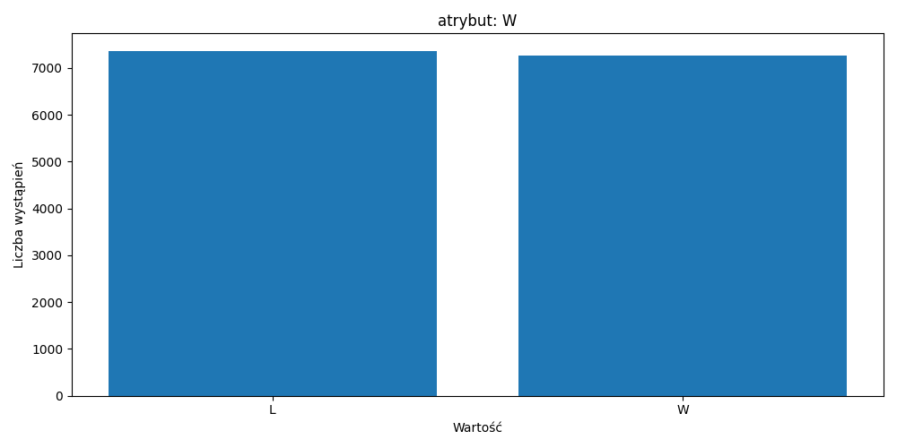

Wartości atrybutu `W` podobnie jak w innych atrybutach binarnych są rozłożone po równo pomiędzy obie opcje.

#### FINAL_MARGIN
`FINAL_MARGIN` to różnica punktów pomiędzy drużyną zawodnika oddającego rzut a drużyną przeciwną. Liczba ujemna świadczy o przegranej, a dodatnia o wygranej.

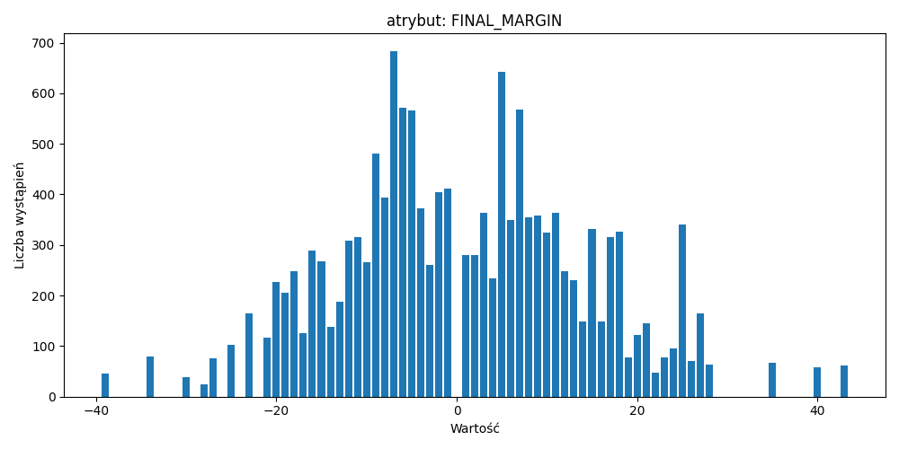

W koszykówce mecz nie może zakończyć się remisem, więc wartość 0 nie występuje w danych. Najczęstsze różnice punktowe w meczach to około 5 punktów na korzyść jednej z drużyn. Mniejsze lub większe różnice występują rzadziej z pojedynczymi przypadkami z różnicami większymi niż 30 punktów.

#### SHOT_NUMBER
`SHOT_NUMBER` jest numerem z kolei rzutu oddawanym przez zawodnika, którym jest zarejestrowany rzut.

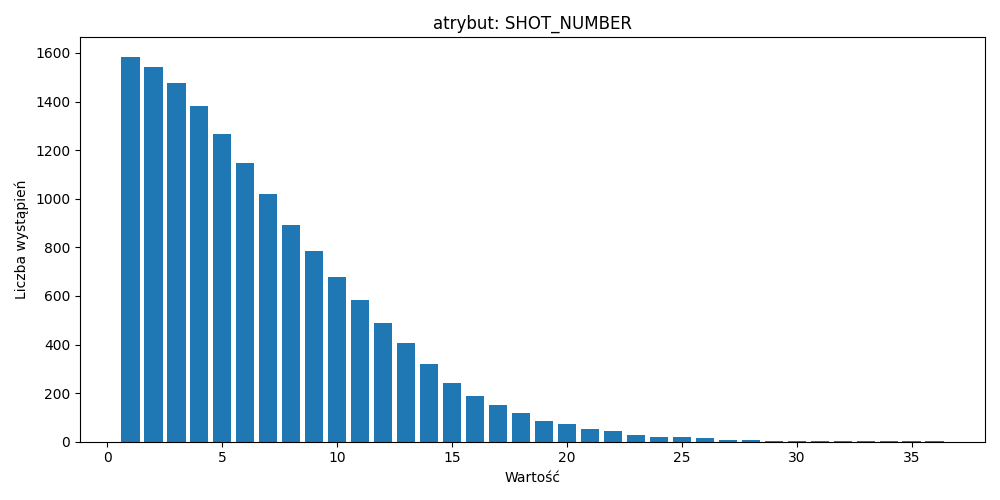

Wśród danych, najczęściej dotyczą one pierwszego rzutu zawodnika. Rozkład przypomina dodatnią połowę rozkładu normalnego.

#### PERIOD
Atrybut `PERIOD` to numer kwarty, w której został oddany rzut.

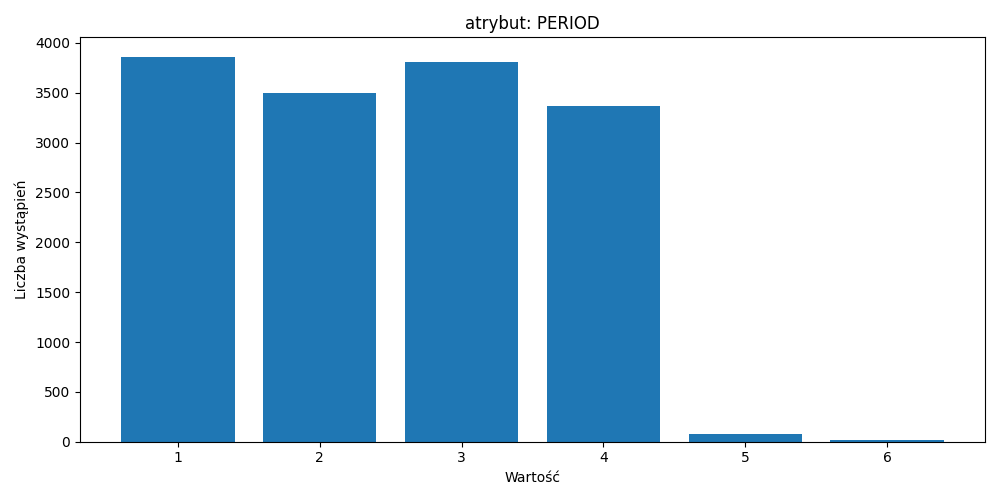

Mecz koszykówki trwa w sumie 4 kwarty. Ewentualne wyższe liczby oznaczają dodatkowe kwarty, które rozgrywane są w przypadku remisu po obowiązkowych 4 kwartach. Gdy w piątej kwarcie mecz nie zostanie rozstrzygnięty, to rozgrywana jest kolejna. Mecz kończy się gdy skończy się czas dogrywki i jedna z drużyn ma więcej punktów. Stąd najmniej danych pochodzi z piątej i szóstej kwarty.

#### GAME_CLOCK
Atrybut `GAME_CLOCK` opisuje liczbę sekund, które minęły odrozpoczęcia kwarty do momentu oddania rzutu. Każda kwarta trwa 12 minut, czyli 720 sekund. Kwarty będące dogrywkami trwają 5 minut, czyli 300 sekund.

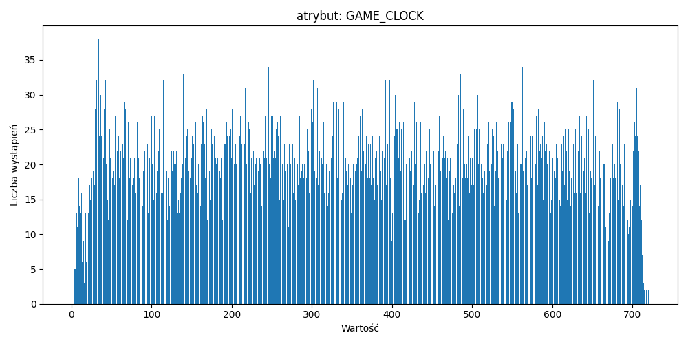

Dane rozłożone są równomiernie w czasie trwania meczu. Widoczny jest mały spadek oddanych rzutów w okolicach końca kwarty.

#### SHOT_CLOCK
Atrybut `SHOT_CLOCK` opisuje liczbę, które upłynęły od początku akcji do jej zakończenia w momencie oddania rzutu. Czas na akcję wynosi 24 sekundy.

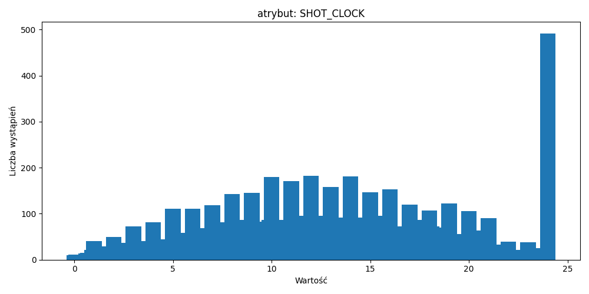

Dane rozłożone są równomiernie w czasie trwania meczu nie licząc piku w 24 sekundzie. W koszykówce w momencie upłynięcia czasu akcji, zawodnicy często oddają jakikolwiek rzut, aby dać sobie szansę trafienia. Jeśli tego nie zrobią, odgwizdany zostanie błąd 24 sekund. Widoczne jest to na wykresie.

#### DRIBBLES
Atrybut `DRIBBLES` jest liczbą kozłów wykonanych przez gracza przed oddaniem rzutu.

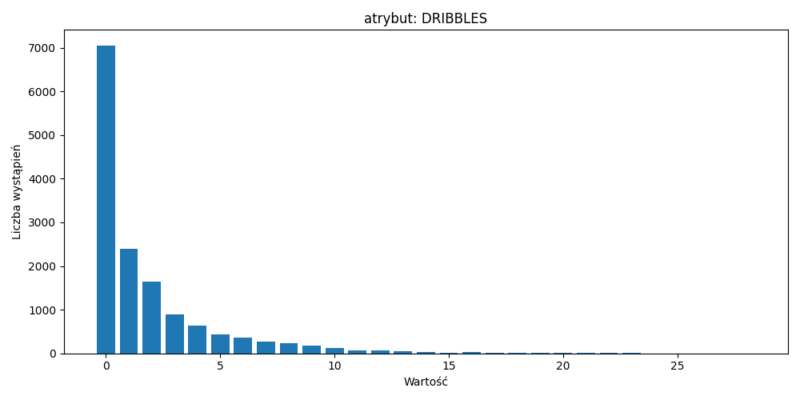

Najwięcej rzutów odawanych jest z tak zwanych akcji 'catch and shoot', które polegają na oddaniu rzutu od razu po złapaniu piłki.

#### TOUCH_TIME
`TOUCH_TIME` to czas posiadania piłki przez zawodnika przed oddaniem rzutu.

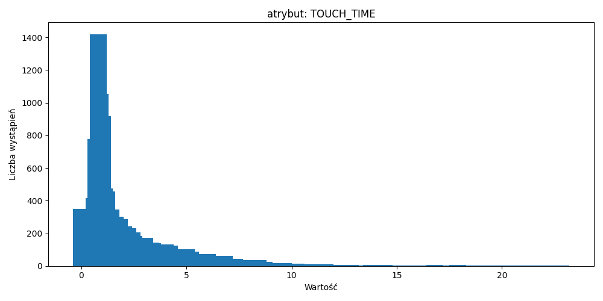

Podobnie jak w przypadku atrybutu `DRIBBLES`, widoczny jest duży udział akcji 'catch and shoot' w akcjach rzutowych zarejestrowanych w zbiorze danych.

#### SHOT_DIST
`SHOT_DIST` opisuje odległość zawodnika od kosza, mierzona w stopach, w momencie oddania rzutu.

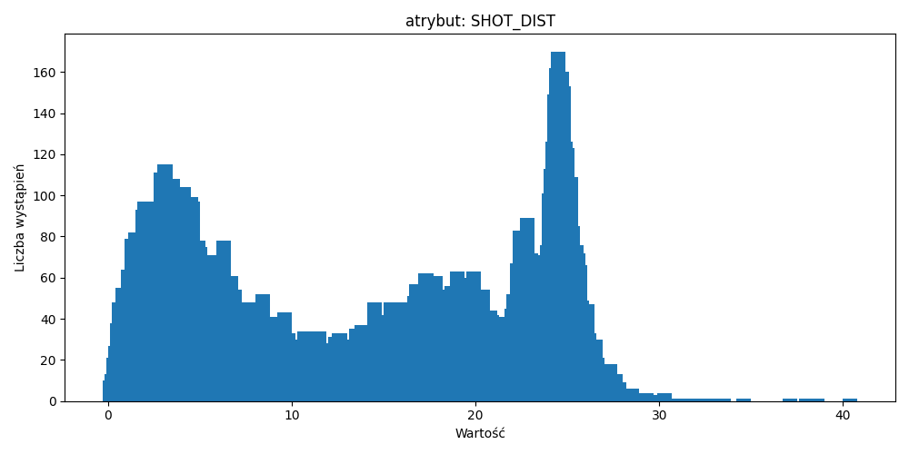

Na wykresie zaobserwować można dużą liczbę rzutów z bliska, czyli okolic 4 stóp od kosza. Jest również ciekawy pik w okolicach linii rzutów za 3 punkty. W koszykówce gracze bardzo rzadko decydują się na rzut dwu punktowy z dalekiej odległości. Dużo bardziej opłacalne jest cofnięcie się jeszcze o kilka kroków i spróbowanie zdobycia 3 punktów.

#### PTS_TYPE
`PTS_TYPE` przyjmuje wartości 2 lub 3 i jest typem rzutu oddanego przez zawodnika. Jest to rzut dwu- lub trzypunktowy.

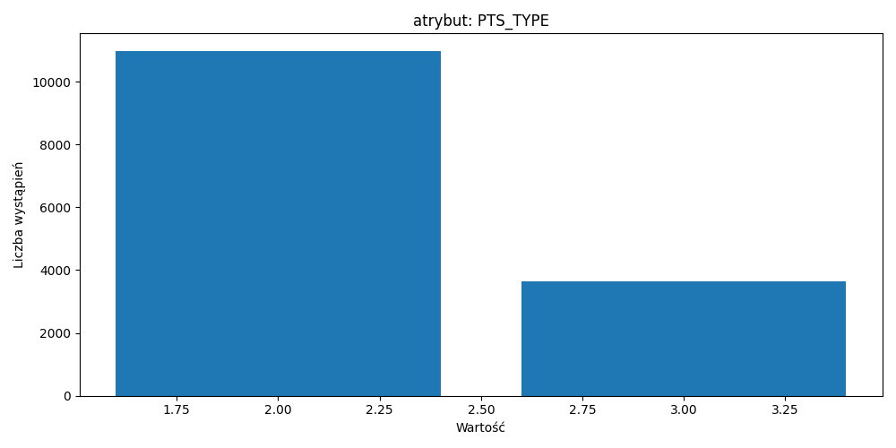

Atrybut `PTS_TYPE` w większości przyjmuje wartość 2, co oznacza, że gracze chętniej oddają rzuty za 2 punkty. Liczba oddanych rzutów za 3 punkty jest około 3 razy mniejsza.

#### CLOSEST_DEFENDER_PLAYER_ID
Atrybut `CLOSEST_DEFENDER_PLAYER_ID` określa ID najbliższego zawodnika z przeciwnej drużyny w momencie oddania rzutu. Każdy obrońca pojawia się średnio 34 razy w zbiorze.

#### CLOSE_DEF_DIST
`CLOSE_DEF_DIST` jest dystansem dzielącym zawodnika oddającego rzut od obrońcy

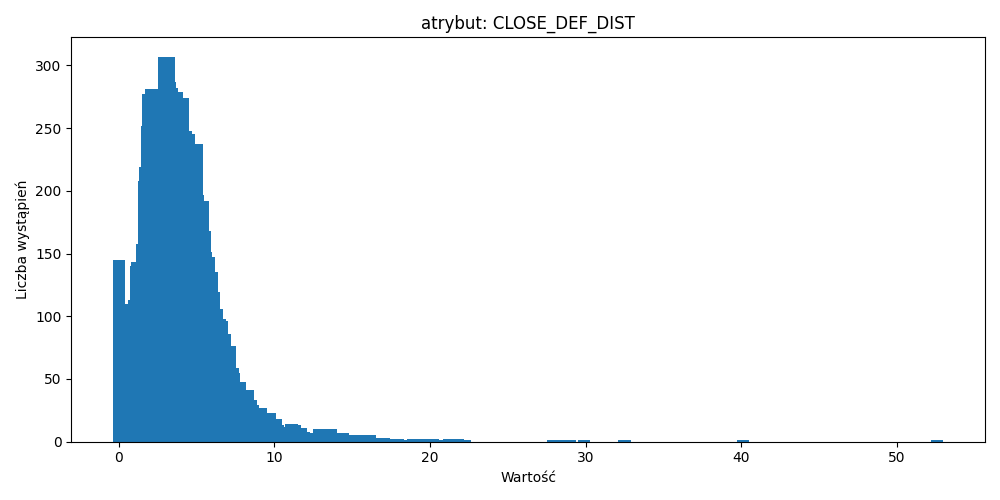

Najczęściej obrońcy oddaleni są o około 5 stóp od rzucającego zawodnika.

#### player_id
Atrybut `player_id` jest identyfikatorem zawodnika oddającego rzut. Każdy zawodnik posiada zarejestrowane około 443 rzuty.

### Przykłady przypadków ze zbioru

Poniżej przedstawione zostały 2 przykładowe przypdaki ze zbioru wraz z ich opisem.

| Atrybut                    | Pierwszy przypadek | Drugi przypadek |
|----------------------------|--------------------|-----------------|
| GAME_ID                    | 21400533           | 21400182        |
| LOCATION                   | H                  | A               |
| W                          | W                  | L               |
| FINAL_MARGIN               | 15                 | -13             |
| SHOT_NUMBER                | 5                  | 5               |
| PERIOD                     | 2                  | 3               |
| GAME_CLOCK                 | 368                | 37              |
| SHOT_CLOCK                 | 15.4               | 12.3            |
| DRIBBLES                   | 1                  | 0               |
| TOUCH_TIME                 | 2.3                | 1.3             |
| SHOT_DIST                  | 3.2                | 1.4             |
| PTS_TYPE                   | 2                  | 2               |
| CLOSEST_DEFENDER_PLAYER_ID | 202730             | 201578          |
| CLOSE_DEF_DIST             | 0.0                | 0.0             |
| player_id                  | 203110             | 203497          |

Oba przypadki pochodzą z dwóch różnych meczów oznaczonych identyfikatorami widocznymi w tablece. Pierwszy mecz odbył się w domu, a drugi na wyjeździe. Pierwszy rzut oddany został w meczy wygranym 15 punktami, a drugi w przegranej 13. Oba rzuty były piątymi rzutami zawodnika. Pierwszy z nich miał miejsce w połowie drugiej kwarty, a drugi na początku trzeciej. Pierwszy i drugi rzut oddane były po około 15 sekundach trwania akcji. Pierwszy rzut oddany był po jednym koźle i 2.3 sekundach posiadania piłki, a drugi bez kozła po 1.3 posiadania piłki. Oba rzuty były rzutami dwupunktowymi z podobnej odległości przy bliskiej odległości obrońcy.

## Wykorzystane algorytmy

Do próby wykrycia rezultatu akcji rzutowej posłużyły następujące techniki. Do wszystkich zostały wykorzystane implementacje dostępne w bibliotece `scikit-learn`.
- DecisionTreeClassifier
- RandomForestClassifier
- LogisticRegression
- AdaBoostClassifier
- VotingClassifier

### DecisionTreeClassifier
Do znalezienia najlepszych parametrów klasyfikatora DecisionTree wykorzystany został GridSearchCV z poniższymi sprawdzanymi parametrami.
```
param_grid = {
    'max_depth': [None, 2, 3, 4, 5, 6, 7, 8, 9, 10],
    'min_samples_split': [2, 5, 10, 20],
    'min_samples_leaf': [1, 2, 4, 8, 16],
    'criterion': ['gini', 'entropy']
}
```

Najlepszymi okazały się parametry przedstawione poniżej.
```
max_depth=5
min_samples_split=2
min_samples_leaf=4
criterion='entropy'
```

Algorytm został nauczony metodą walidacji krzyżowej z podziałem próby na 10 części. Osiągnął średnią wartość accuracy podczas walidacji krzyżowej równą 59.02% przy odchyleniu standardowym równym 2.15% oraz accuracy na zbiorze testowym równą 62.58%. Najważniejszymi atrybutami okazały się `SHOT_DIST` z wskaźnikiem ważności równym ponad 0.5, `CLOSE_DEF_DIS` z ważnością równą około 0.23 oraz `TOUCH_TIME` z ważnością równą około 0.1. Pozostałe atrybuty posiadają wartość ważności mniejszą od 0.05. Wizualizacja drzewa przedstawiona została na poniższym obrazku.

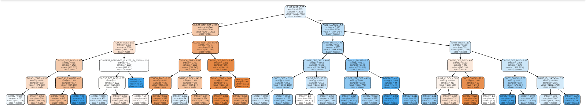

### RandomForestClassifier
Do znalezienia najlepszych parametrów klasyfikatora RandomForest wykorzystany został GridSearchCV z poniższymi sprawdzanymi parametrami.
```
param_grid = {
    'n_estimators': [100, 150, 200],
    'max_depth': [10, 20, None],
    'min_samples_split': [2, 5, 10],
    'min_samples_leaf': [1, 2, 4]
}
```

Najlepszymi okazały się parametry przedstawione poniżej.
```
n_estimators=200
max_depth=20
min_samples_split=5
min_samples_leaf=1
```

Algorytm został nauczony metodą walidacji krzyżowej z podziałem próby na 10 części. Osiągnął średnią wartość accuracy podczas walidacji krzyżowej równą 60.75% przy odchyleniu standardowym równym 1.01% oraz accuracy na zbiorze testowym równą 62.79%.


### LogisticRegression
Do znalezienia najlepszych parametrów regresji logistycznej wykorzystany został GridSearchCV z poniższymi sprawdzanymi parametrami.
```
param_grid = {
    'penalty': ['l1', 'l2'],
    'C': [0.001, 0.01, 0.1, 1, 10, 100],
    'solver': ['liblinear', 'saga'],
    'class_weight': [None, 'balanced']
}
```

Najlepszymi okazały się parametry przedstawione poniżej.
```
penalty='l1'
C=0.1
solver='saga'
class_weight=None
```

Algorytm został nauczony metodą walidacji krzyżowej z podziałem próby na 10 części. Osiągnął średnią wartość accuracy podczas walidacji krzyżowej równą 58.38% przy odchyleniu standardowym równym 1.07% oraz accuracy na zbiorze testowym równą 61.33%.

### AdaBoostClassifier
Do znalezienia najlepszych parametrów regresji logistycznej wykorzystany został GridSearchCV z poniższymi sprawdzanymi parametrami.

```
param_grid = {
    'n_estimators': [50, 100],
    'learning_rate': [0.05, 0.1, 0.5]
}
```

Najlepszymi okazały się parametry przedstawione poniżej.
```
n_estimators=100
learning_rate=0.1
```

Algorytm został nauczony metodą walidacji krzyżowej z podziałem próby na 10 części. Osiągnął średnią wartość accuracy podczas walidacji krzyżowej równą 61.54% przy odchyleniu standardowym równym 0.97% oraz accuracy na zbiorze testowym równą 62.69%.

### VotingClassifier
VotingClassifier składa się z trzech podstawowych klasyfikatorów. Są to `RandomForestClassifier`, `LogisticRegression` oraz `AdaBoostClassifier` z parametrami takimi, jakie zostały wyliczone za pomocą GridSearchCV.

Algorytm został nauczony metodą walidacji krzyżowej z podziałem próby na 10 części. Dla parametru voting ustawionego na wartość 'hard' osiągnął średnią wartość accuracy podczas walidacji krzyżowej równą 61.28% przy odchyleniu standardowym równym 1.27% oraz accuracy na zbiorze testowym równą 62.93%. Dla parametru voting ustawionego na wartość 'soft' osiągnął on lepszą, średnią wartość accuracy podczas walidacji krzyżowej równą 60.01% przy odchyleniu standardowym równym 1.74% oraz accuracy na zbiorze testowym równą 61.97%.

## Wnioski
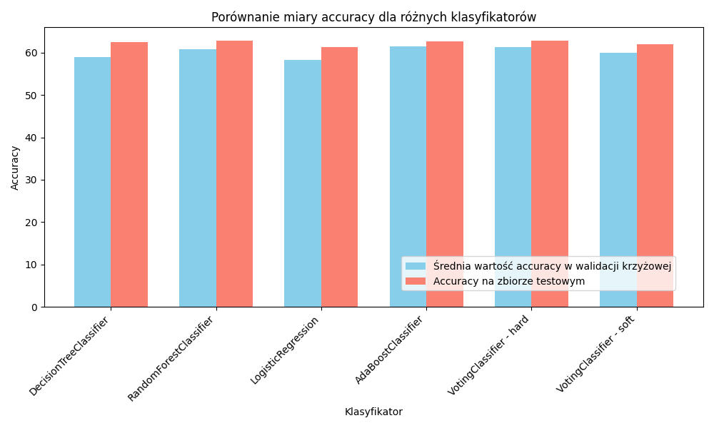

Wszystkie klasyfikatory osiągają podobne, oscylujące w okolicach 60% wartość accuracy. Najlepiej wypada RandomForestClassifier, AdaBoostClassifier oraz VotingClassifier w wersji 'hard'. Najgorzej wypada regresja logistyczna, a DecisionTreeClassifier i VotingClassifier w wersji 'soft' wypadają pomiędzy.

Na pierwszy rzut oka może wydawać się to rozczarowujące, ponieważ mamy do czynienia z klasyfikatorami binarnymi i gdyby poprosić dziecko o zgadywanie jaki powinien być efekt rzutu, to miało by ono accuracy równe około 50%. Tak słabe wyniki mogą wynikać ze specyfiki zbioru i trudności w jego interpretacji przez model. Zjawiska jakie przedstawia, czyli rezultaty akcji rzutowych w meczach NBA w rzeczywistośći są bardzo trudne do przewidzenia. Zawodnicy czasami trafiają trudne akcje, które mogłoby się wydawać, że "nie mają prawa wpaść", a czasami nie trafiają prostych sytuacji. Inną rzeczą jest to, że gdy mają do czynienia z trudną sytuacją, czyli taką gdzie na przykład są daleko od kosza lub gdy mają blisko siebie obrońcę, to nie oddają rzutu i czekają na lepszą pozycję. Po analizie zbioru, można dojść do wniosku, że lepszym pomysłem byłaby próba analizy zapisu danych dotyczących rzutów na treningach lub dane zawierające więcej danych dotyczących zmęczenia zawodnika jak na przykład jego czas spędzony na boisku. Biorąc pod uwagę trudności w przewidzeniu skuteczności akcji rzutowej można stwierdzić, że modele radzą sobie w tej sytuacji lepiej niż człowiek, który musiałby zdać się na szczęście i trafienie z poprawnymi predykcjami.


## Literatura i źródła
- https://www.kaggle.com/datasets/dansbecker/nba-shot-logs/data
- https://scikit-learn.org/
